<div align="center">


# Project Apex

### A full-stack e-commerce platform built with Next.js 16 — fast, modern, and production-ready.

[](https://nextjs.org/)
[](https://www.typescriptlang.org/)
[](https://tailwindcss.com/)
[](https://www.prisma.io/)
[](https://firebase.google.com/)
[](https://razorpay.com/)
[](https://vercel.com/)

</div>

---

## 📸 Screenshots

<table>
  <tr>
    <td align="center">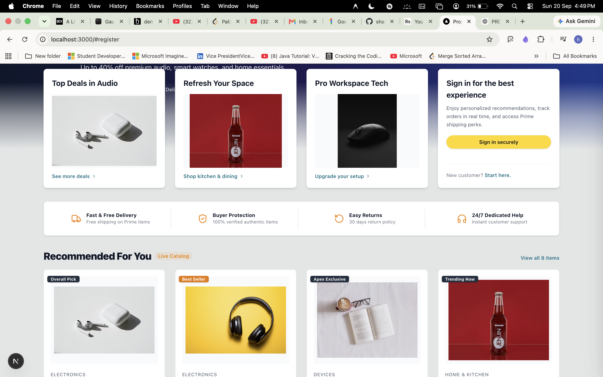<br/><sub><b>Homepage — Hero & Deals</b></sub></td>
    <td align="center">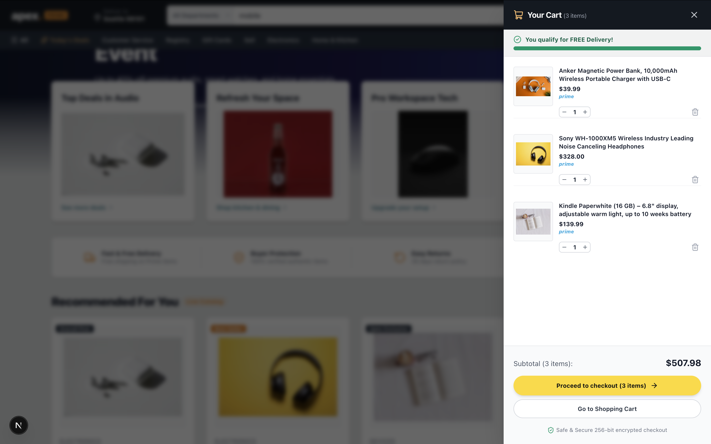<br/><sub><b>Hero Section & Featured Categories</b></sub></td>
  </tr>
  <tr>
    <td align="center">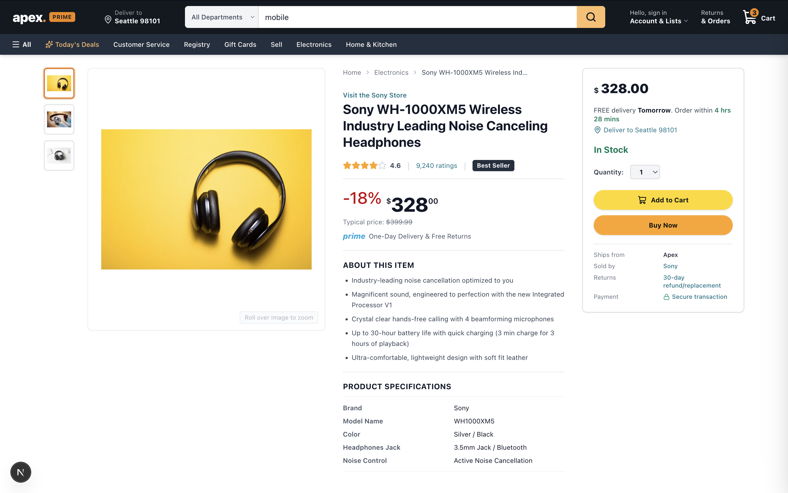<br/><sub><b>Mobile / Department Navigation Drawer</b></sub></td>
    <td align="center">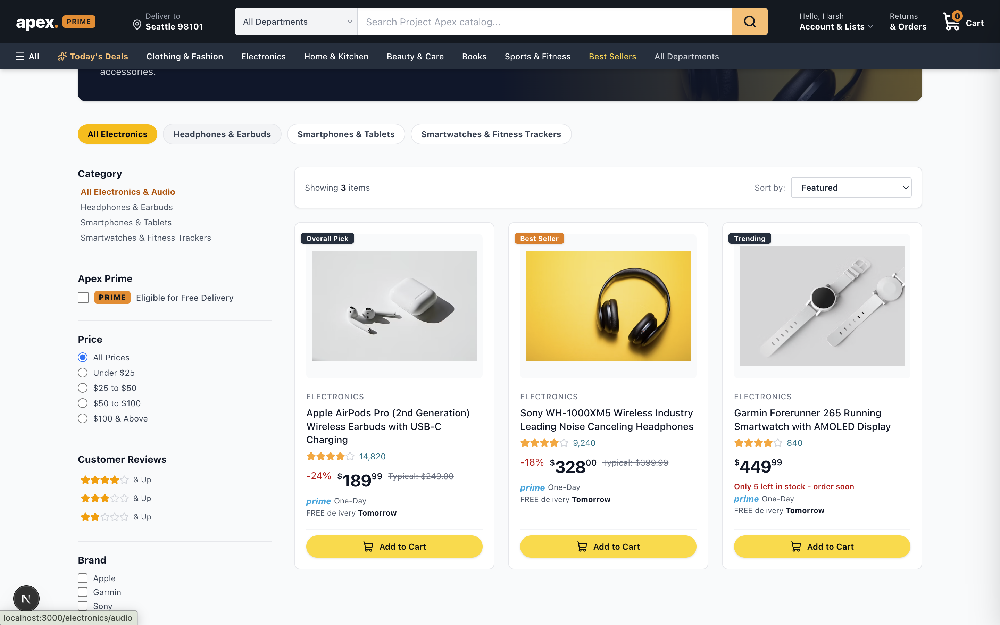<br/><sub><b>Product Listing Page</b></sub></td>
  </tr>
  <tr>
    <td align="center">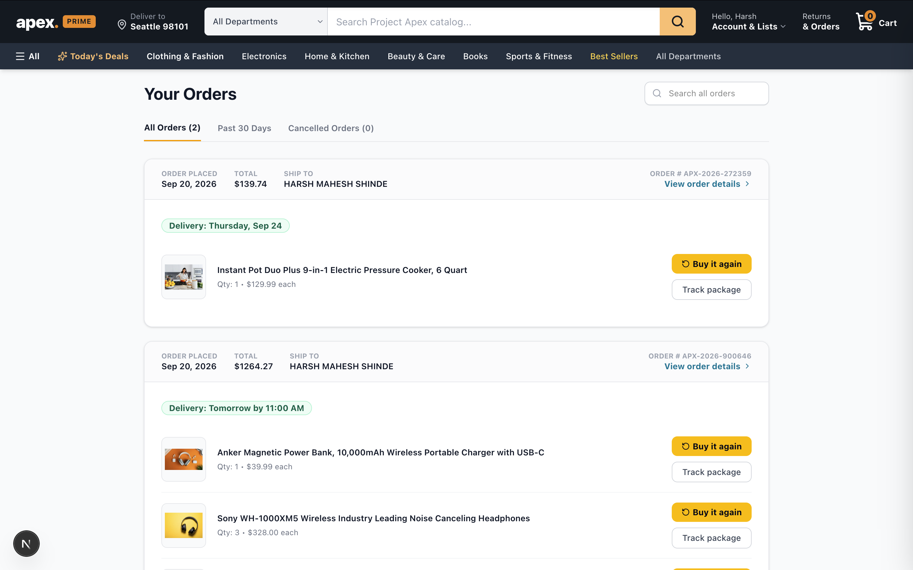<br/><sub><b>Product Detail Page</b></sub></td>
    <td align="center">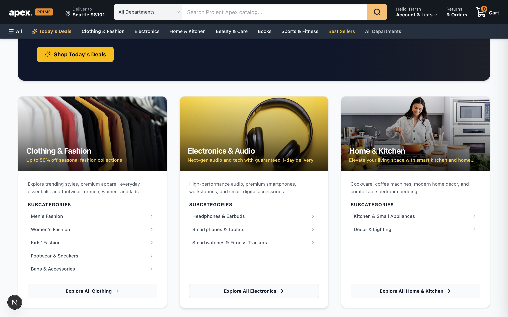<br/><sub><b>Shopping Cart</b></sub></td>
  </tr>
  <tr>
    <td align="center">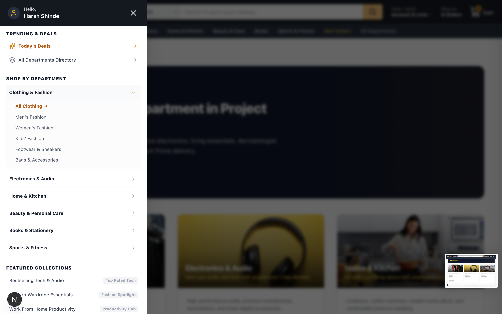<br/><sub><b>Checkout Flow</b></sub></td>
    <td align="center">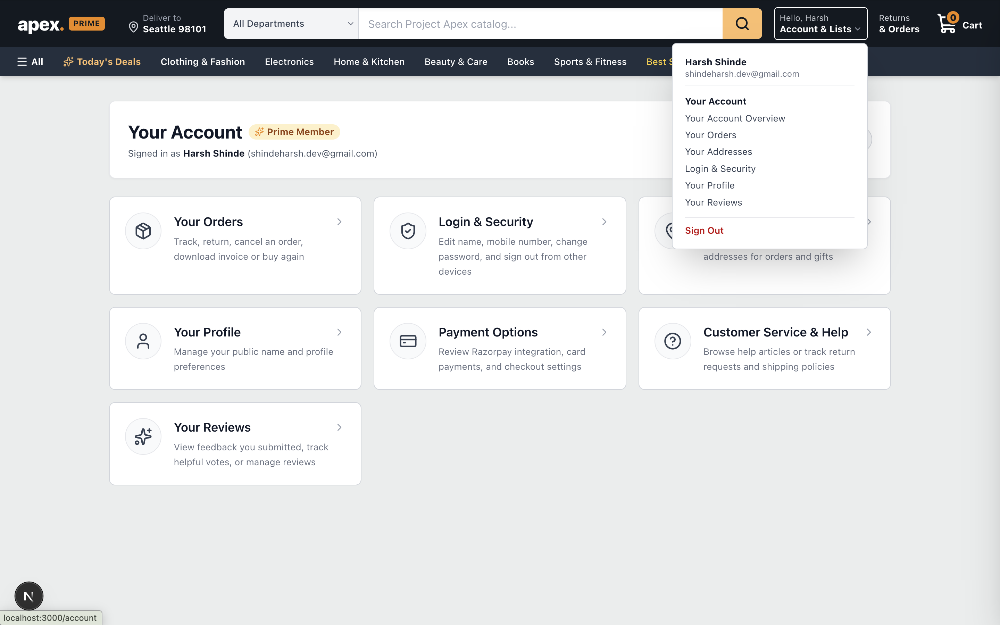<br/><sub><b>Payment Gateway (Razorpay)</b></sub></td>
  </tr>
  <tr>
    <td align="center">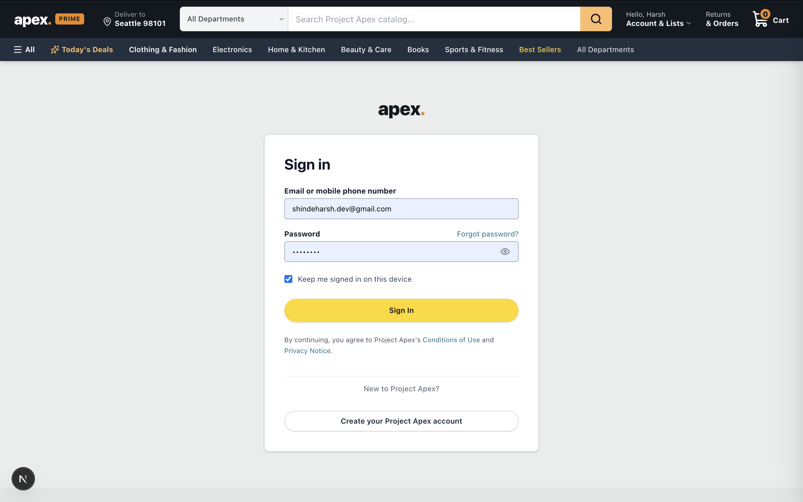<br/><sub><b>Order History</b></sub></td>
    <td align="center">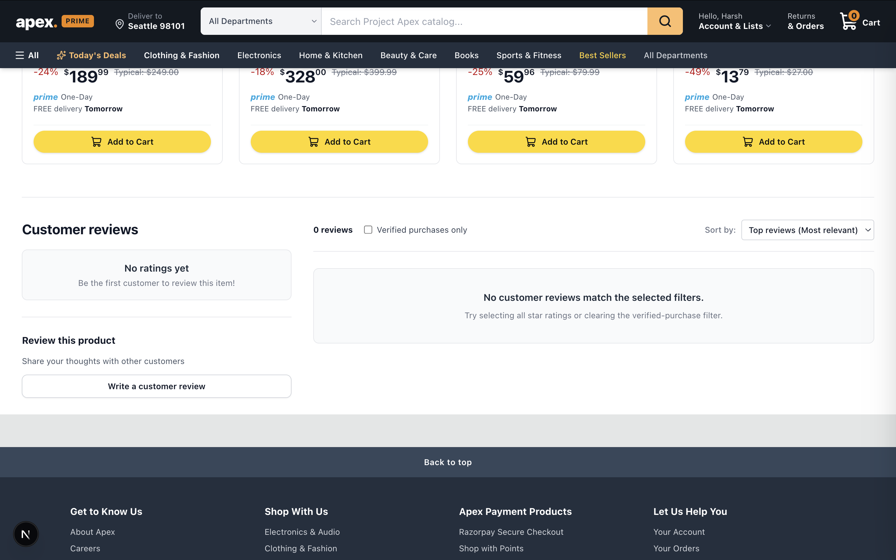<br/><sub><b>Account Dashboard</b></sub></td>
  </tr>
  <tr>
    <td align="center">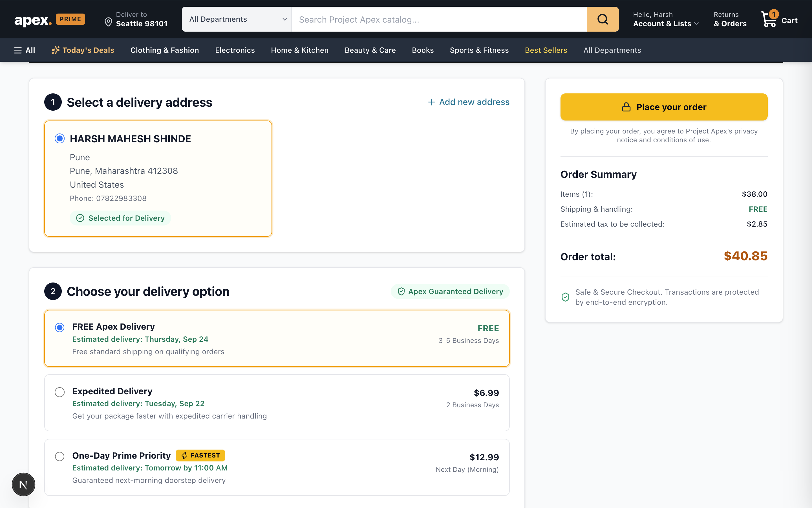<br/><sub><b>Sign In Page</b></sub></td>
    <td align="center">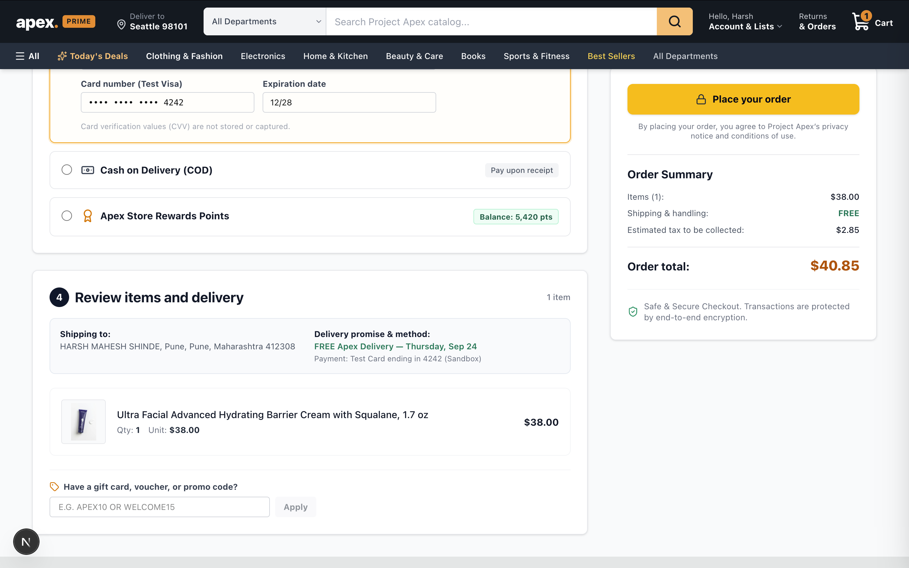<br/><sub><b>Registration Page</b></sub></td>
  </tr>
</table>

---

## 🚀 Tech Stack

| Layer | Technology | Version |
|---|---|---|
| **Framework** | [Next.js](https://nextjs.org/) (App Router) | 16.3.5 |
| **Language** | [TypeScript](https://www.typescriptlang.org/) | 5.x |
| **Styling** | [Tailwind CSS](https://tailwindcss.com/) | v4 |
| **Database** | [PostgreSQL](https://www.postgresql.org/) via [Supabase](https://supabase.com/) | — |
| **ORM** | [Prisma](https://www.prisma.io/) | 6.4.1 |
| **Authentication** | [Firebase Auth](https://firebase.google.com/products/auth) + [better-auth](https://www.better-auth.com/) | 12 / 1.7.5 |
| **Payments** | [Razorpay](https://razorpay.com/) (UPI + Cards + Wallets) | 2.9.8 |
| **Email** | [Nodemailer](https://nodemailer.com/) | 10.x |
| **State Management** | [Zustand](https://zustand-demo.pmnd.rs/) | 5.x |
| **Validation** | [Zod](https://zod.dev/) | 4.x |
| **Icons** | [Lucide React](https://lucide.dev/) | 1.47.0 |
| **Hosting** | [Vercel](https://vercel.com/) | — |

---

## ✨ Features (A–Z)

### 🔐 Authentication & Accounts
- **Better-Auth + Firebase** dual-layer authentication (email/password & social sign-in)
- **Email verification** flow with token-based links
- **Forgot password** and **Reset password** via secure email link
- **Persistent sessions** — stay logged in across page refreshes
- **Protected routes** — automatic redirect to login for authenticated-only pages
- **User profile management** — update name, email, and account settings

### 🛒 Cart & Checkout
- **Persistent cart** — cart state saved in Zustand and hydrated from localStorage
- **Real-time cart total** — instant recalculation on quantity change or item removal
- **Multi-step checkout** — Address → Delivery → Payment in a clean stepper UI
- **Address management** — save, edit, and select multiple shipping addresses
- **Order summary** — full itemized breakdown before payment confirmation

### 🗂️ Categories & Navigation
- **6 main departments** — Clothing & Fashion, Electronics & Audio, Home & Kitchen, Beauty & Care, Books & Stationery, Sports & Fitness
- **Sub-category navigation** — drill down into Men's, Women's, Kids' fashion and more
- **Mobile navigation drawer** — slide-in department menu with collapsible subcategory trees
- **Today's Deals** — dedicated deals page with highlighted markdowns
- **Collections page** — curated themed collections (e.g., "Work From Home Productivity")
- **All Departments directory** — grid layout of every category

### 📦 Orders & Tracking
- **Order placement** — full order creation with line items, pricing, and address
- **Order history** — tabbed view of All Orders, Past 30 Days, Cancelled Orders
- **Order detail page** — per-item breakdown, delivery estimate, and order ID
- **Track Package** button — deep link to shipment tracking
- **Buy it again** — one-click re-add of previous items to cart
- **Order search** — search through past orders by product name

### 💳 Payments
- **Razorpay integration** — Credit/Debit cards, Net Banking, UPI, and Wallets
- **UPI QR Code** — display in-app QR for UPI apps (Google Pay, PhonePe, Paytm)
- **INR currency** — default India-first payment configuration
- **Payment success/failure handling** — feedback shown instantly after gateway response
- **Cash on Delivery** option at checkout

### 🛍️ Products
- **Product listing pages** per category with filtering and sorting
- **Product detail page** — images, description, pricing, stock status, and variants
- **Product badges** — "Best Seller", "Apex Exclusive", "Overall Pick", "Trending Now"
- **Product reviews** — paginated review list with sort options (relevance, newest, rating)
- **Review summary** — star-rating breakdown with average score
- **Related products** — recommended items shown on detail page
- **Search** — full-text search across the product catalog

### 🌐 Pages & UX
- **Homepage** — personalized hero banner, featured deals cards, trust badges, recommended section
- **About page** — company information and brand story
- **Help & Support page** — FAQ and contact section
- **Legal pages** — Terms of Service, Privacy Policy
- **Responsive design** — optimized for mobile, tablet, and desktop
- **Google Analytics** — gtag.js integration for event tracking

### 🔧 Developer & Infrastructure
- **API Routes** — full REST API layer under `app/api/` (products, orders, reviews, auth, cart)
- **Prisma schema** — fully typed ORM models for User, Product, Order, Review, Address
- **Supabase PostgreSQL** — managed cloud database with connection pooling
- **Environment-variable sanitization** — auto-strip newlines/quotes from `.env` values
- **Vercel deployment** — zero-config CI/CD with `vercel.json` for correct root directory
- **`prisma generate`** runs automatically on `build` and `postinstall`
- **Zod validation** — schema-validated API request bodies
- **TypeScript strict mode** — full type safety across the codebase

---

## 🗂️ Project Structure

```
project-apex/
├── docs/
│   └── screenshots/         # Project screenshots for README
├── prisma/
│   └── schema.prisma        # Database schema (User, Product, Order, Review, Address)
├── public/                  # Static assets
├── scripts/                 # Utility & test scripts
├── src/
│   ├── app/                 # Next.js App Router pages & API routes
│   │   ├── api/             # REST API endpoints
│   │   ├── cart/            # Cart page
│   │   ├── checkout/        # Checkout flow
│   │   ├── orders/          # Order history & detail
│   │   ├── products/        # Product listing & detail
│   │   ├── account/         # Account settings
│   │   ├── login/           # Authentication pages
│   │   └── ...              # Category pages, legal, help, etc.
│   ├── components/          # Reusable React components
│   │   ├── checkout/        # Payment selector, address form, order summary
│   │   ├── navigation/      # Header, MobileNavDrawer, CategoryNav
│   │   ├── products/        # ProductCard, ReviewList, etc.
│   │   └── ui/              # Shared UI primitives
│   ├── data/                # Mock product catalogue & seed data
│   ├── lib/                 # Firebase, Prisma, auth client/server, Razorpay
│   ├── store/               # Zustand stores (cart, user)
│   └── types/               # Global TypeScript types
├── .env.example             # Environment variable template
├── vercel.json              # Vercel deployment config
└── package.json
```

---

## ⚙️ Getting Started

### Prerequisites
- **Node.js** >= 18
- **npm** >= 9
- A **Supabase** project (for PostgreSQL)
- A **Firebase** project (for authentication)
- A **Razorpay** account (for payments)

### 1. Clone the repository

```bash
git clone https://github.com/sharsh07-dev/8x.git
cd 8x/project-apex
```

### 2. Install dependencies

```bash
npm install
```

### 3. Configure environment variables

Copy `.env.example` to `.env.local` and fill in your values:

```bash
cp .env.example .env.local
```

| Variable | Description |
|---|---|
| `DATABASE_URL` | Supabase PostgreSQL connection string (pooler, port 5432) |
| `BETTER_AUTH_SECRET` | Random secret string for session signing |
| `NEXT_PUBLIC_APP_URL` | Your app's public URL (e.g. `https://yourdomain.vercel.app`) |
| `NEXT_PUBLIC_FIREBASE_API_KEY` | Firebase Web API Key |
| `NEXT_PUBLIC_FIREBASE_AUTH_DOMAIN` | Firebase Auth Domain |
| `NEXT_PUBLIC_FIREBASE_PROJECT_ID` | Firebase Project ID |
| `FIREBASE_ADMIN_PROJECT_ID` | Firebase Admin SDK Project ID |
| `FIREBASE_ADMIN_CLIENT_EMAIL` | Firebase Admin SDK Client Email |
| `FIREBASE_ADMIN_PRIVATE_KEY` | Firebase Admin SDK Private Key |
| `RAZORPAY_KEY_ID` | Razorpay Key ID |
| `RAZORPAY_KEY_SECRET` | Razorpay Key Secret |
| `SMTP_HOST` | Email SMTP host |
| `SMTP_PORT` | Email SMTP port |
| `SMTP_USER` | SMTP username |
| `SMTP_PASS` | SMTP password |

> **Supabase Note:** Use the **Transaction Pooler** connection string (port `5432`) — Vercel is IPv4-only and cannot reach Supabase's direct host.

### 4. Sync the database schema

```bash
npx prisma db push
```

### 5. Run the development server

```bash
npm run dev
```

Open [http://localhost:3000](http://localhost:3000) in your browser.

---

## 🚢 Deploying to Vercel

1. Push your code to GitHub.
2. Import the repository at [vercel.com/new](https://vercel.com/new).
3. Set the **Root Directory** to `project-apex`.
4. Add all environment variables from `.env.example` in the Vercel dashboard.
5. Deploy — Vercel will run `prisma generate && next build` automatically.

---

## 📜 Scripts

| Command | Description |
|---|---|
| `npm run dev` | Start local development server |
| `npm run build` | Generate Prisma client & build for production |
| `npm run start` | Start production server |
| `npm run lint` | Run ESLint |
| `npm run test:orders` | Run order flow integration test |

---

## 📄 License

This project is for educational and portfolio purposes.

---

<div align="center">
  Built with ❤️ by <strong>Harsh Shinde</strong>
</div>
